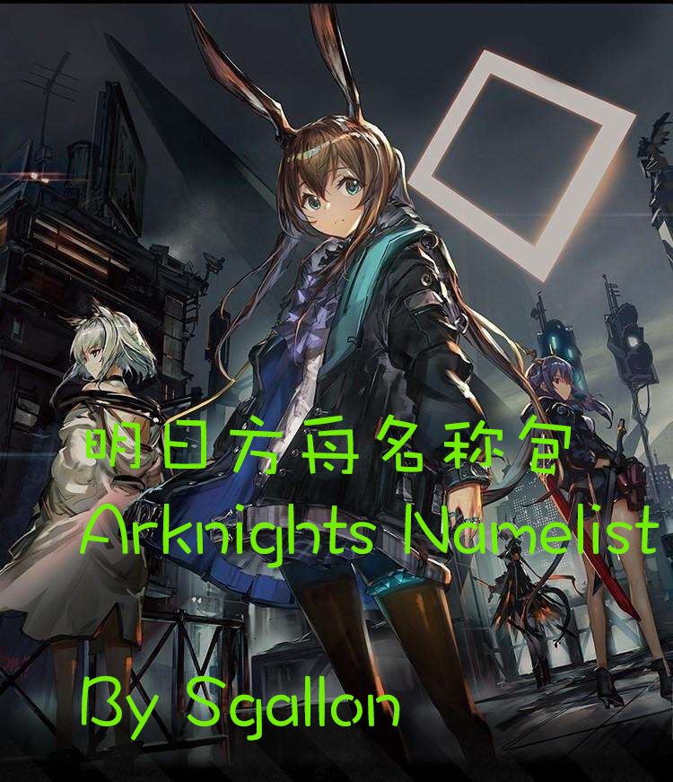

# Arknights name list | 明日方舟名称包 (for Stellaris)

## 关于 | About



自制 群星明日方舟名称包mod | Fan-made Arknights namelist mod for Stellaris

支持简体中文、英文 | Supports Simplified Chinese and English

在Steam创意工坊订阅 | Subscribe on Steam Community Workshop: 
[Arknights name list | 明日方舟名称包](https://steamcommunity.com/sharedfiles/filedetails/?id=2217999914)

在Github查看 | View on [Github](https://github.com/sgallon-rin/stellaris-arknights-namelist)

说明：
- 殖民地 -- 明日方舟中的地名
- 领袖名 -- 明日方舟中的干员代号
- 领袖姓氏 -- 明日方舟中的种族 
- 舰船名 -- 明日方舟中的关卡名
- 舰队名 -- 明日方舟中的行动名（危机合约）

Description:
- Colonies -- Countries and cities in Arknights
- Names of leaders -- Codenames in Arknights
- Surnames of leaders -- Species in Arknights
- Ship names -- Level names in Arknights
- Fleet names -- Operations in Arknights (Contingency Contracts)

建议搭配明日方舟种族包食用 | Better with Arknights species mods

*只是一个简单的名称包，~~旧版mod应该可以适用于新版游戏。~~ 名称包里所有字符串都改成了变量我是没想到的... 蠢驴！

*This mod only includes namelists. ~~If the game has been updated, this mod should still work fine.~~ 
Every single string has been changed into a variable in a namelist ... Donkey!

*因为已经弃坑了舟游，以后的更新中可能只会包含干员代号，种族和危机合约。

*As I no longer play Arknights, following updates may only contain codenames, species, and contingency contracts.

---

## 已知问题 | Known issues

~~（都是蠢驴导致的）| (All of them are caused by Paradox)~~

1. 序列名显示为乱码`%SEQ%` | Cannot properly display sequential name (shown as `%SEQ%`).

以上问题可能会也可能不会在后续版本中修复 | The problems above may or may not be fixed in future releases.

---

## 更新记录 | Updates

### 2023.12.26 ver 1.3.0

修复了无法选择英文名称包的bug（选中后会自动回到中文版）。

Fixed the bug that the English version of the namelist cannot be chosen 
(it automatically went back to the Chinese version).

### 2022.12.03 ver 1.2.1

领袖名更新至「斥罪」；
舰队名更新至「赝波行动」。

Updated names till "Penance";
updated fleet names till "Operation Fake Waves".

### 2022.01.04 ver 1.2.0

领袖名更新至「灵知」；
舰队名更新至「松烟行动」；
修正了「泥岩」的性别。

Updated names till "Gnosis";
updated fleet names till "Operation Pinesoot";
corrected gender of "Mudrock".

### 2021.07.22 ver 1.1.0

修复了localisation中的bug；
添加了封面。

Fixed bug in localisation; 
added cover.

### 2020.09.03 ver 1.0.0

初投稿至Steam创意工坊。

First upload to Steam Workshop.

---

## 在本地安装（测试用） | Install locally (for test)

1. 克隆本仓库，复制mod文件至mod目录 | Clone this repository and copy mod files:
```
git clone git@github.com:sgallon-rin/stellaris-arknights-namelist.git
cd stellaris-arknights-namelist/mod
cp -r arknights_namelist '~/Documents/Paradox Interactive/Stellaris/mod/arknights_namelist'
cd '~/Documents/Paradox Interactive/Stellaris/mod'
cp arknights_namelist/descriptor.mod arknights_namelist.mod
```

2. 使用随便什么文本编辑器打开刚刚复制的`arknights_namelist.mod`，在最后一行加上`path="mod/arknights_namelist"` |
Open the file `arknights_namelist.mod` with any text editor you like and add `path="mod/arknights_namelist"`.

3. 打开启动器，刷新已安装mod列表。没有问题的话应该能够看到本mod。记得添加到播放集并启用mod。群星，启动！ |
Open Stellaris launcher and refresh the list of installed mods. You should be able to see this mod as a local mod. 
Don't forget to add it into a playlist and activate it before launching the game.

---

## 声明 | Acknowledgements

<a rel="license" href="http://creativecommons.org/licenses/by-nc-sa/4.0/"></a>
<br />本作品采用<a rel="license" href="http://creativecommons.org/licenses/by-nc-sa/4.0/">知识共享署名-非商业性使用-相同方式共享 4.0 国际许可协议</a>进行许可。
<br />This work is licensed under a <a rel="license" href="http://creativecommons.org/licenses/by-nc-sa/4.0/">Creative Commons Attribution-NonCommercial-ShareAlike 4.0 International License</a>.

mod的主要参考资料来自于[PRTS](https://prts.wiki)。

mod内使用的游戏图片、文本原文，其版权属于 [Arknights/上海鹰角网络科技有限公司](https://ak.hypergryph.com)。
